# Guide d'installation — SOC Detection Lab

Stack : **Wazuh 4.14.5** (all-in-one) + **agent Windows** + **Sysmon**

---

## 1. Environnement VirtualBox

Deux VMs sur un réseau privé hôte (`vboxnet0`, plage `192.168.56.0/24`) :

| VM | OS | RAM | IP |
|----|----|-----|----|
| SIEM-WAZUH | Ubuntu (64-bit) | 6 Go | 192.168.56.104 |
| WIN-VICTIME | Windows 10 (64-bit) | 4 Go | 192.168.56.105 |

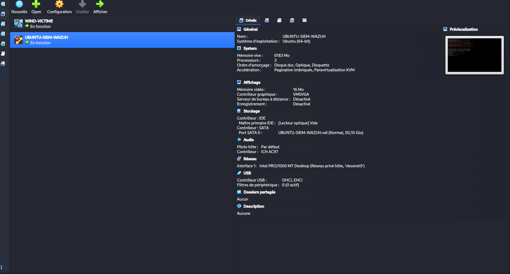
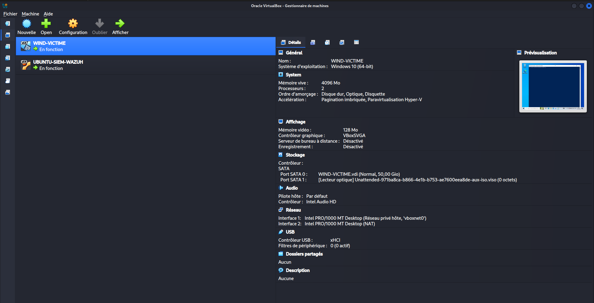

---

## 2. Installation de Wazuh sur SIEM-WAZUH

### 2.1 Téléchargement du script d'installation

```bash
curl -sO https://packages.wazuh.com/4.x/wazuh-install.sh
sudo bash wazuh-install.sh -a
```

> L'option `-a` installe le manager, l'indexer et le dashboard en one-shot.

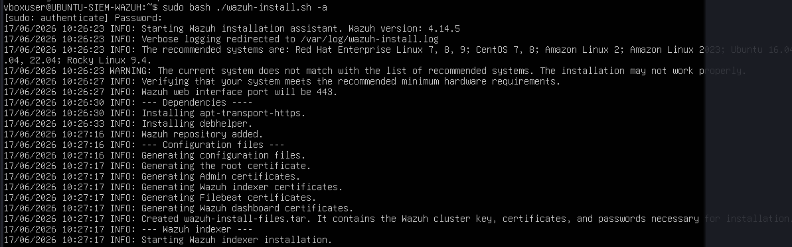

### 2.2 Résolution des erreurs lors de la première tentative

La première exécution peut rencontrer des erreurs liées à des paquets partiellement
installés ou à une installation précédente incomplète.

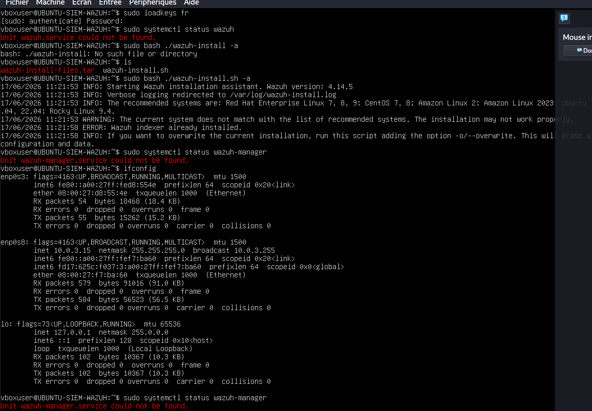
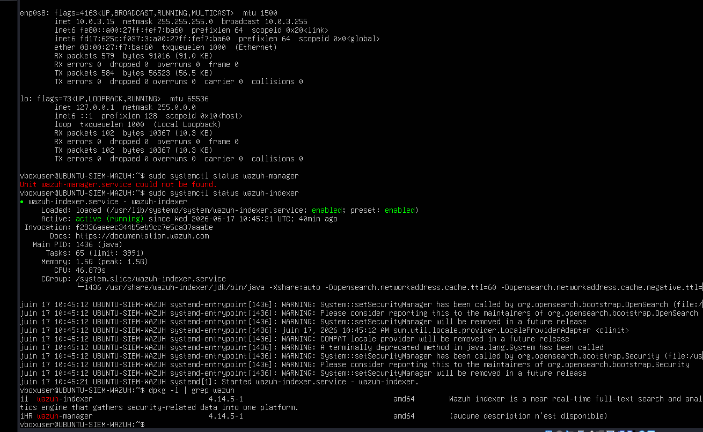

Procédure de nettoyage avant réinstallation :

```bash
sudo systemctl stop wazuh-indexer
sudo apt remove --purge wazuh-manager wazuh-indexer wazuh-dashboard -y
sudo dpkg --configure -a
```

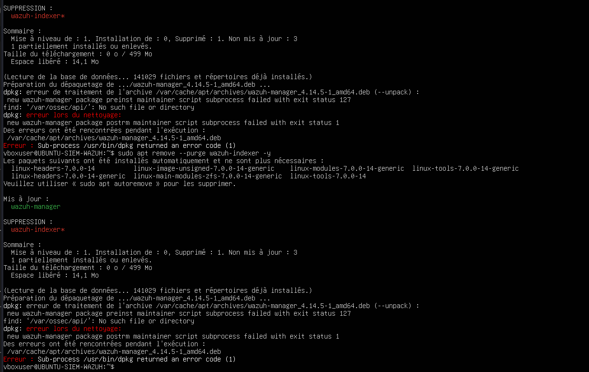
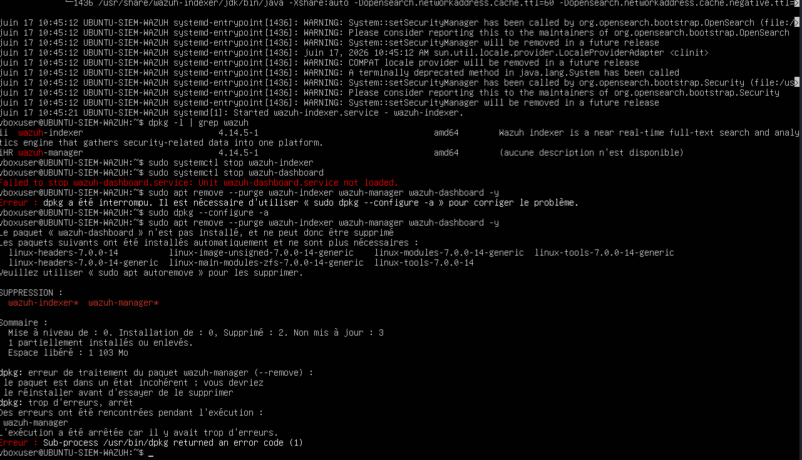
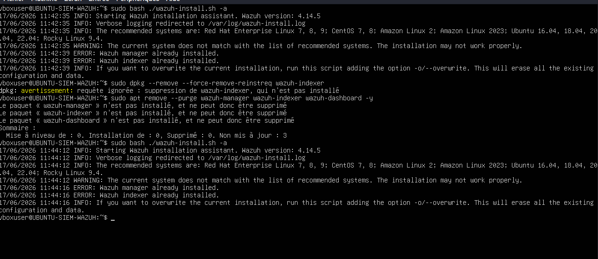

### 2.3 Installation finale réussie

```bash
sudo bash wazuh-install.sh -a
```

À la fin de l'installation, le script affiche les credentials d'accès au dashboard :

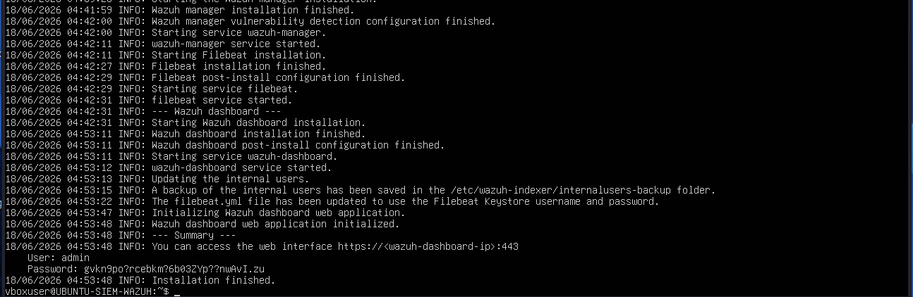

```
User:     admin
Password: <généré automatiquement>
URL:      https://192.168.56.104:443
```

**Conserver ces credentials** — ils ne sont pas récupérables sans réinitialisation.

### 2.4 Vérification des services

```bash
sudo systemctl restart wazuh-indexer wazuh-manager
sudo systemctl status wazuh-manager
```

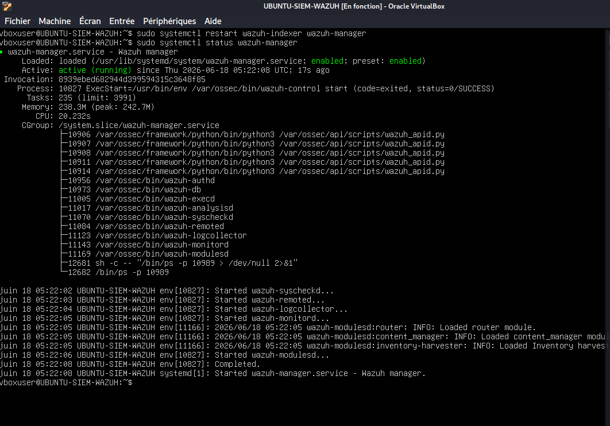

---

## 3. Installation de l'agent Wazuh sur WIN-VICTIME

### 3.1 Ouvrir la page de déploiement

Dans le dashboard Wazuh (`https://192.168.56.104`) → **Endpoints** → **Deploy new agent**.

À ce stade, aucun agent n'est enregistré :

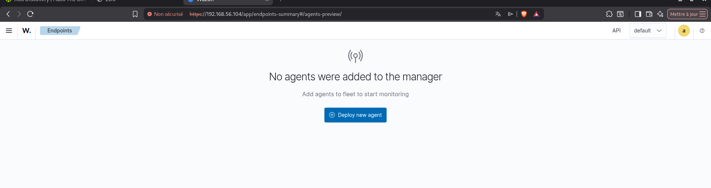

### 3.2 Configurer l'agent

Renseigner :
- **Server address :** `192.168.56.104`
- **Agent name :** `WIN-VICTIME`
- **OS :** Windows

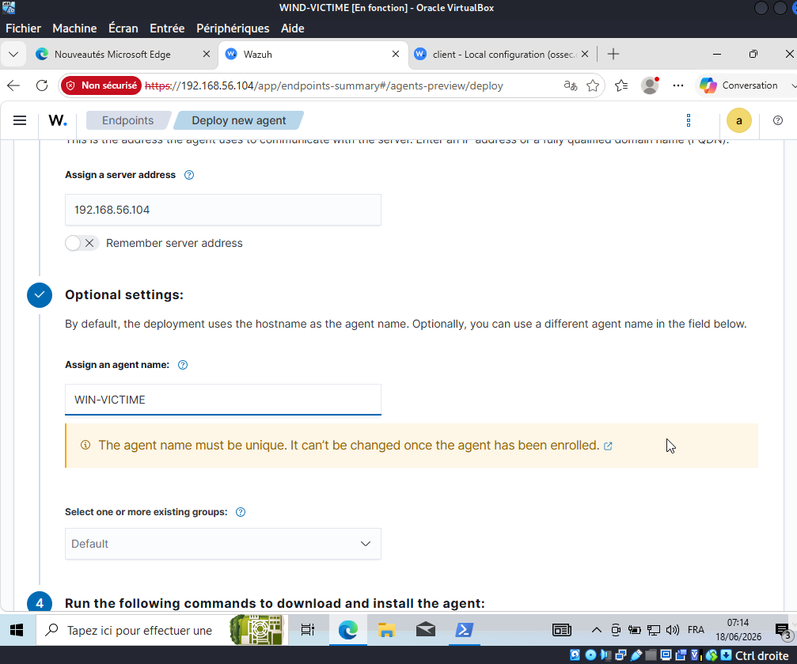

### 3.3 Installer l'agent sur WIN-VICTIME (PowerShell admin)

```powershell
Invoke-WebRequest -Uri https://packages.wazuh.com/4.x/windows/wazuh-agent-4.14.5-1.msi `
  -OutFile $env:tmp\wazuh-agent
msiexec.exe /i $env:tmp\wazuh-agent /q `
  WAZUH_MANAGER='192.168.56.104' WAZUH_AGENT_NAME='WIN-VICTIME'
```

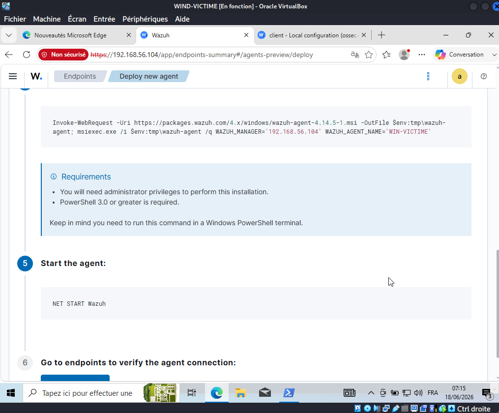

```powershell
NET START Wazuh
```

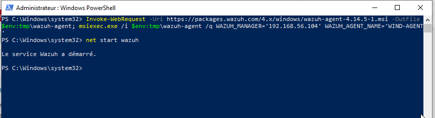

### 3.4 Dépannage — erreurs de connexion initiales

Lors des premières tentatives, l'agent peut afficher des erreurs de connexion au service
d'enrôlement (`1515`) si le manager n'est pas encore entièrement initialisé :

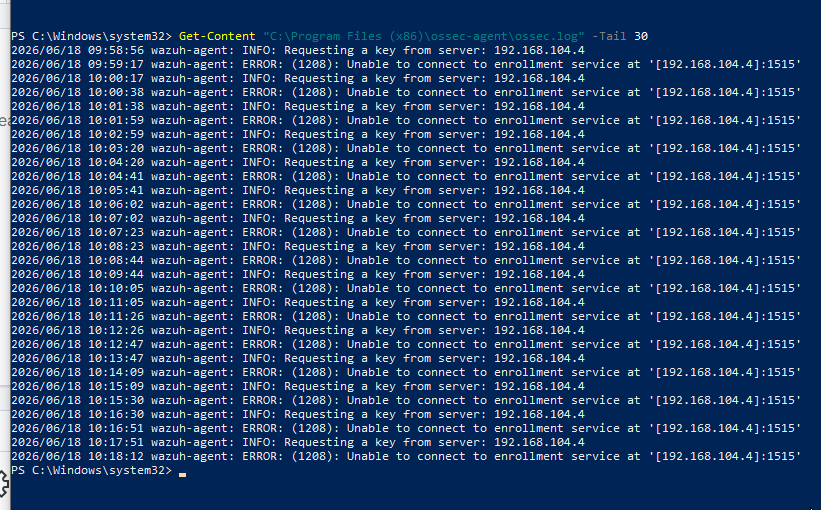

Attendre que le manager soit `active (running)` puis relancer l'agent.

### 3.5 Vérification de la connexion

```powershell
Get-Content "C:\Program Files (x86)\ossec-agent\ossec.log" -Tail 30
```

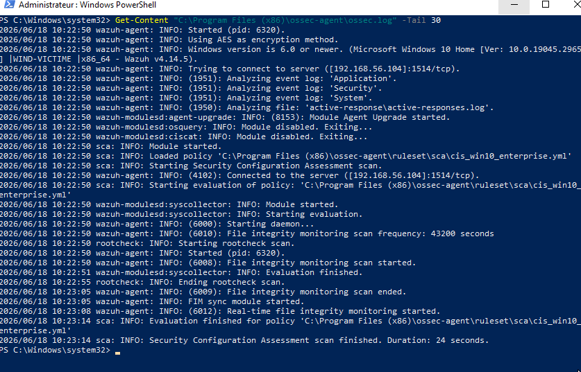

La ligne `Connected to the server ([192.168.56.104]:1514/tcp)` confirme la connexion.

---

## 4. Configuration de Sysmon

Sysmon enrichit considérablement les logs Windows remontés à Wazuh (Event ID 1, 11, 13…).

### 4.1 Installer Sysmon

Télécharger [Sysmon](https://learn.microsoft.com/en-us/sysinternals/downloads/sysmon)
et l'installer avec la config SwiftOnSecurity (ou toute config adaptée) :

```powershell
sysmon64.exe -accepteula -i sysmonconfig.xml
```

### 4.2 Déclarer le canal Sysmon dans ossec.conf

Éditer `C:\Program Files (x86)\ossec-agent\ossec.conf` et ajouter en fin de fichier,
avant `</ossec_config>` :

```xml
<localfile>
    <location>Microsoft-Windows-Sysmon/Operational</location>
    <log_format>eventchannel</log_format>
</localfile>
```

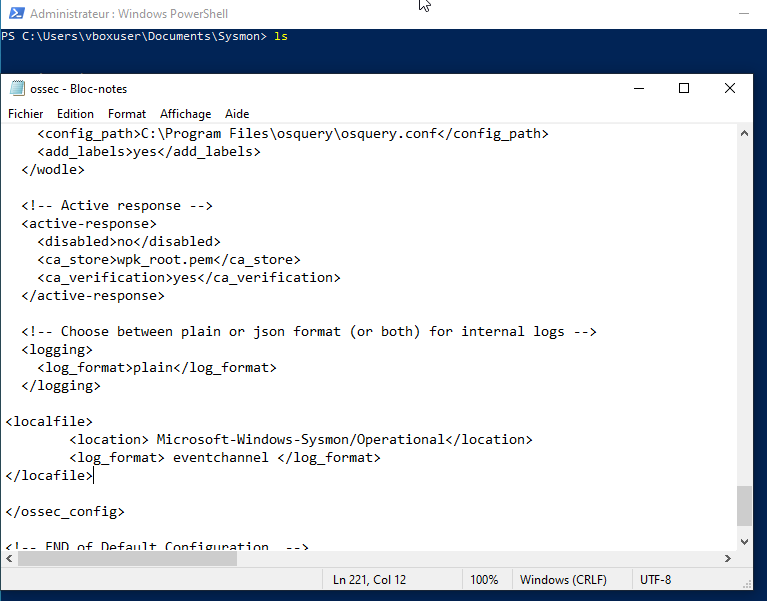
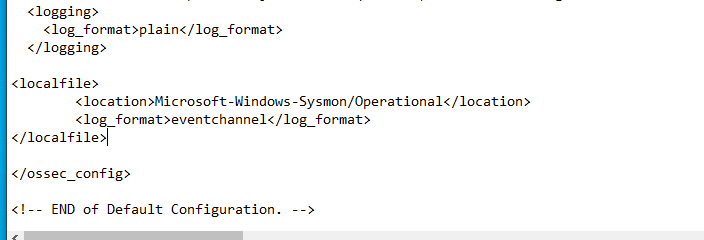

### 4.3 Redémarrer l'agent

```powershell
NET STOP Wazuh
NET START Wazuh
```

Les événements Sysmon apparaissent maintenant dans Wazuh sous `data.win.system.channel:
Microsoft-Windows-Sysmon/Operational`.

---

## 5. Vérification finale

Depuis le dashboard Wazuh → **Overview** : l'agent WIN-VICTIME doit être **Active (1)**.

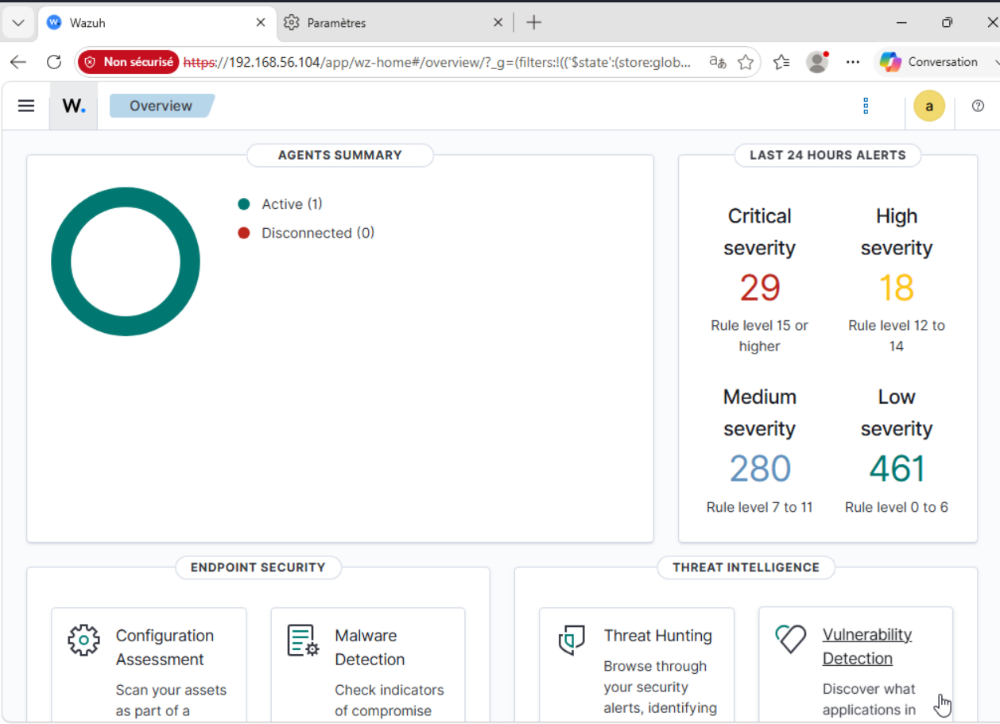
