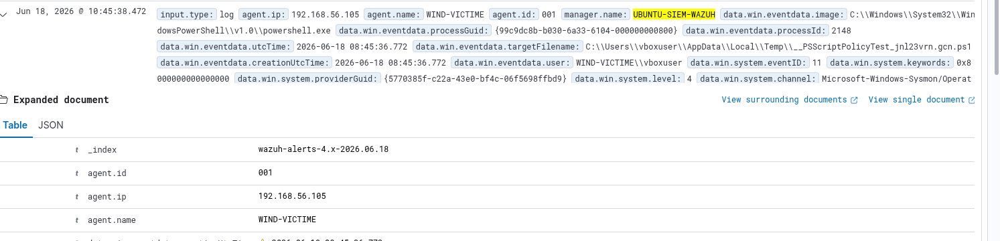

# Tuning — Gestion des faux positifs

---

## Incident — PSScriptPolicyTest (faux positif T1059.001)

### Contexte

Lors de la mise en place de la détection PowerShell, une alerte récurrente est apparue
sur des fichiers `__PSScriptPolicyTest_*.ps1`. Ce fichier est créé automatiquement par
PowerShell à chaque vérification de sa politique d'exécution des scripts — comportement
bénin, interne à PowerShell.

### Détail de l'alerte

| Champ | Valeur |
|-------|--------|
| Règle déclenchée | 92213 — Sysmon Event ID 11 (File Create) |
| Fichier | `C:\Users\vboxuser\AppData\Local\Temp\__PSScriptPolicyTest_jnl23vrn.gcn.ps1` |
| Agent | WIN-VICTIME |
| Manager | SIEM-WAZUH |
| Niveau | 3 (avant suppression) |



### Analyse

Ce fichier est généré par le moteur PowerShell lui-même pour tester la politique
d'exécution configurée sur la machine. Il n'est pas malveillant. L'alerte est un faux
positif structurel dès lors que PowerShell est activement utilisé sur l'endpoint.

### Correction appliquée

Règle de suppression ajoutée dans [`rules/local_rules.xml`](../rules/local_rules.xml) :

```xml
<!-- Faux positif : fichier de test de politique PowerShell (bénin) -->
<rule id="100110" level="0">
  <if_sid>92213</if_sid>
  <field name="win.eventdata.targetFilename" type="pcre2">
    (?i)__PSScriptPolicyTest_.*\.ps1$
  </field>
  <description>PowerShell script policy test file — faux positif connu, ignoré</description>
</rule>
```

**Niveau 0** : l'alerte est silencée (override la règle parente 92213).

### Leçon SOC

La gestion des faux positifs est un travail continu. Chaque règle de suppression doit
être documentée ici pour traçabilité. Une règle `level="0"` mal ciblée pourrait masquer
une vraie menace — vérifier systématiquement la regex de correspondance avant de
l'appliquer en production.
